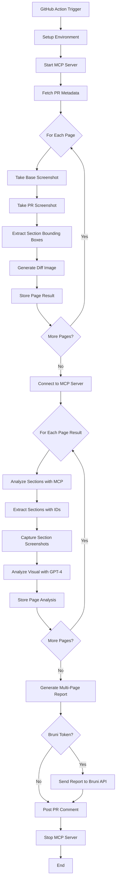
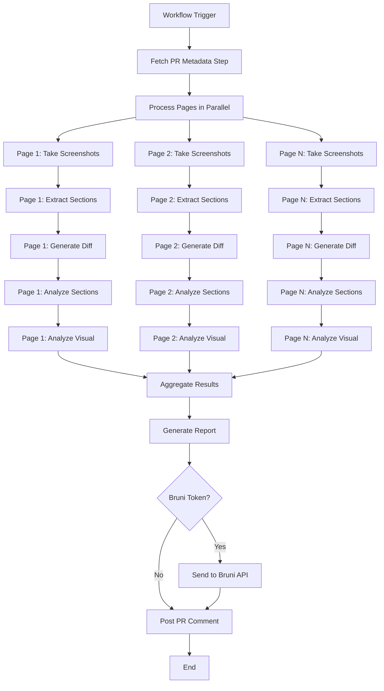
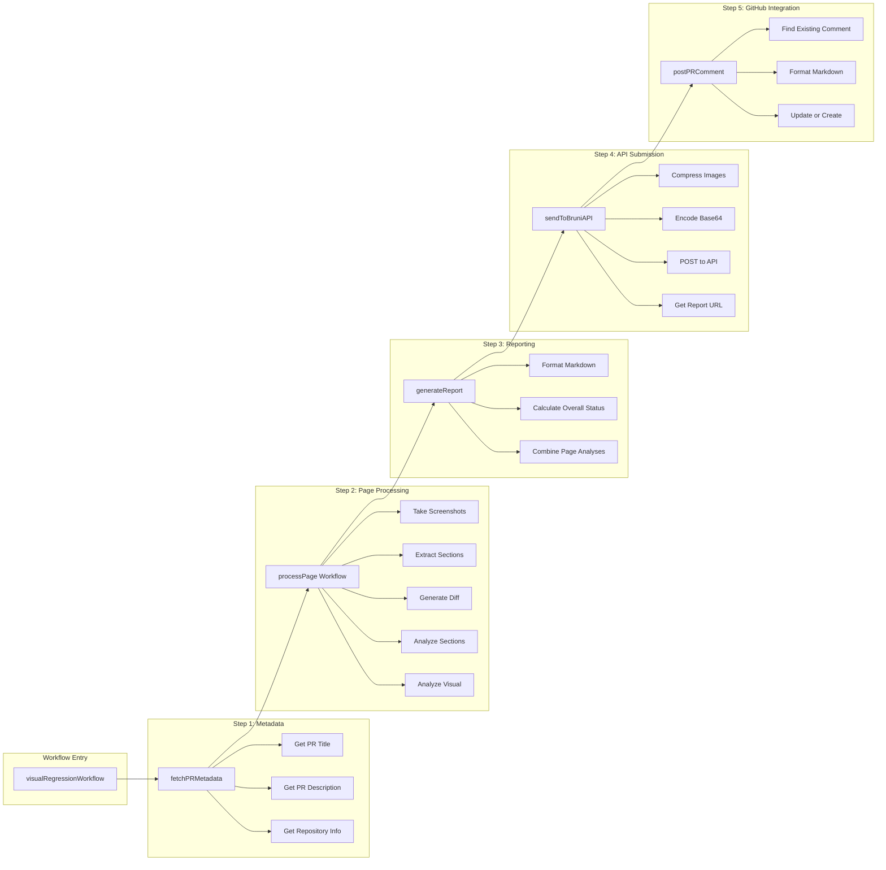
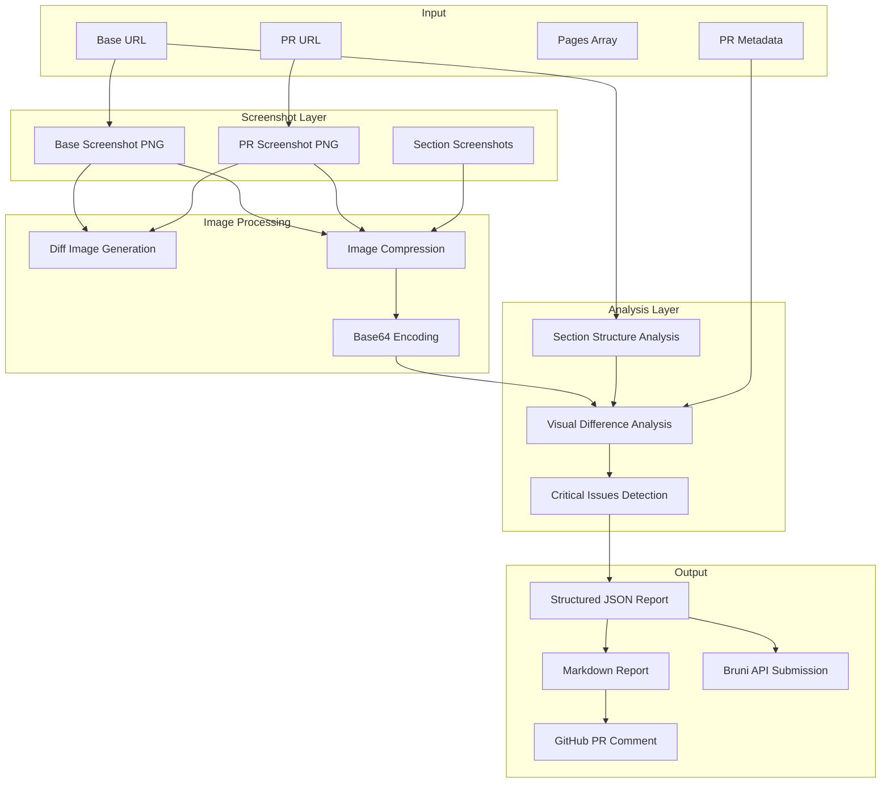
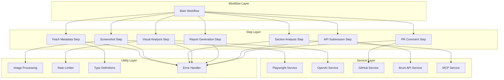
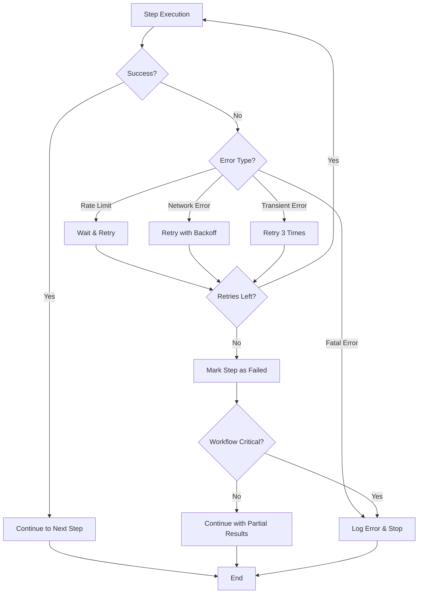
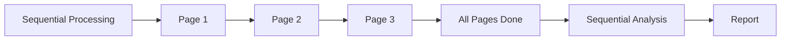
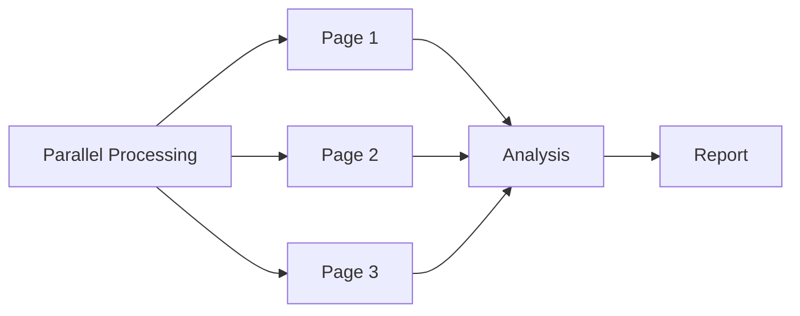
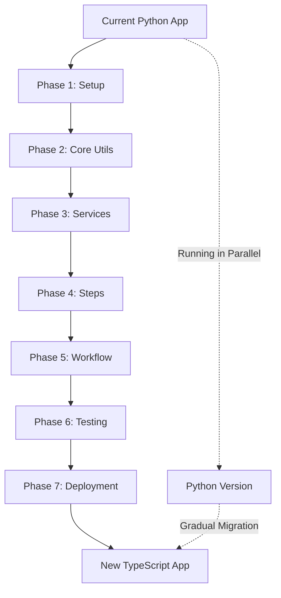

# BruniAI Workflow Diagrams

## Current Python Workflow (Sequential)

## Proposed TypeScript Workflow (Parallelized)

## Detailed Step Breakdown (useWorkflow)

## Data Flow Diagram

## Component Architecture

## Error Handling Flow

## Comparison: Current vs Proposed

### Current (Python)

### Proposed (TypeScript)

## Performance Comparison

| Aspect | Current (Python) | Proposed (TypeScript) |
|--------|------------------|----------------------|
| **Page Processing** | Sequential | Parallel |
| **Observability** | Logging only | Built-in traces & metrics |
| **Error Recovery** | Manual retries | Automatic retry logic |
| **State Persistence** | None | Automatic state saving |
| **Type Safety** | Runtime checks | Compile-time checks |
| **Image Processing** | PIL (slower) | Sharp (faster) |

## Migration Path Visualization

